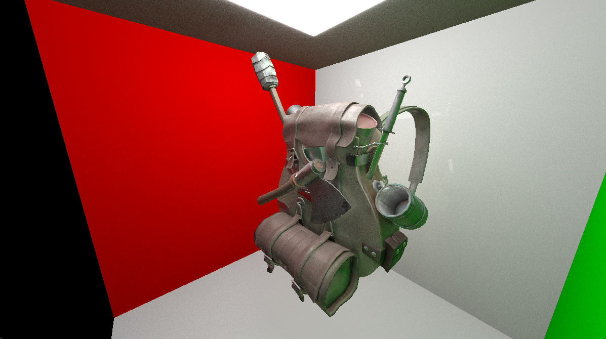

# Raytracer
A standard progressive raytracer.

For school, but I just took it as an excuse to make an awesome project. Following "Raytracing in One Weekend", but interpreted (in my own code) into C++ and GLSL.

Example:

Non-statically-linked build command:
`g++ src/main.cpp src/glad.c src/shaders.cpp -o bin/main.exe -I include -L lib -lglfw3dll`
Statically-linked build command:
`g++ src/main.cpp src/glad.c src/shaders.cpp -o bin/main.exe -L "lib" -I "include" -static -static-libgcc -static-libstdc++ -lglfw3 -lopengl32 -lgdi32`